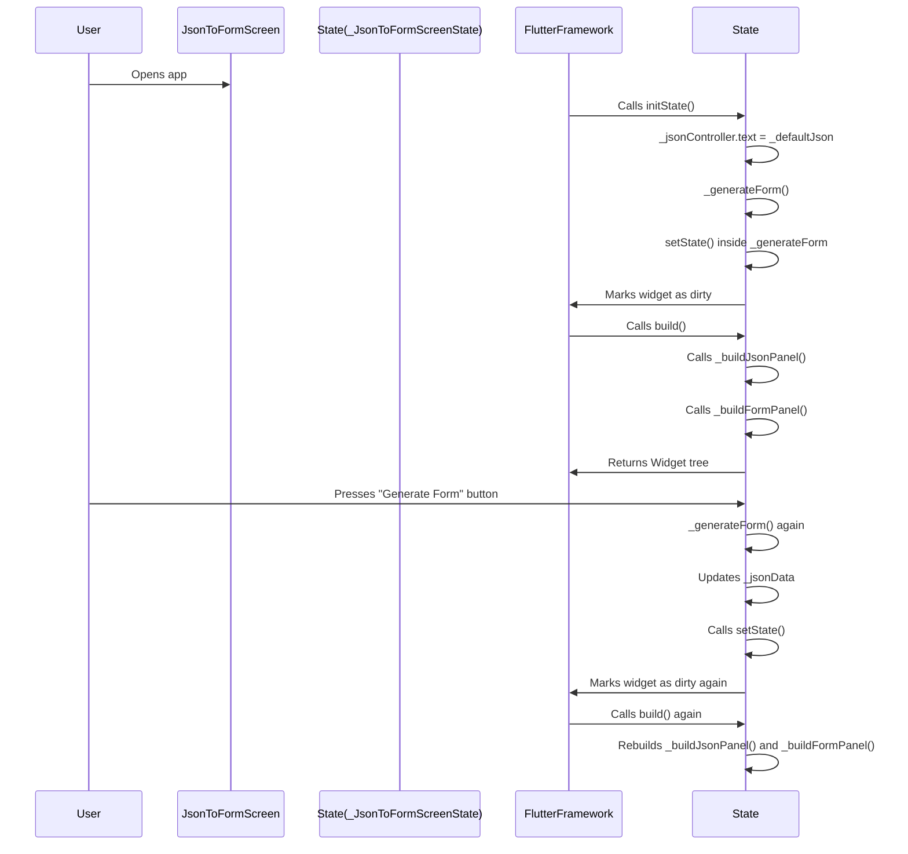

The interaction between `_jsonData`, `setState`, and Flutter’s widget rebuild mechanism is what causes `_buildFormPanel()` to re-run.  

---

## 🔎 Why `_buildFormPanel` is triggered

1. **The Flutter Render Cycle**
   - Every Flutter widget has a `build` method. A `StatefulWidget` has a separate `State` object that overrides `build`.  
   - Flutter calls `build()` automatically whenever it needs to redraw the widget tree (first load, when the state changes, or when dependencies change).

2. **Your setup**
   - `_buildFormPanel` is **not** called by you directly.  
   - Instead, it is used **inside the `build` method** of your `State`:
     ```dart
     body: SplitView(
       children: [
         _buildJsonPanel(),
         _buildFormPanel(), // << here
       ],
     ),
     ```
   - That means every time `build()` is called, `_buildFormPanel()` is called too.

3. **What triggers `build()`?**
   - Whenever you call `setState(() { ... })`, Flutter:
     - Marks the widget’s state as “dirty”.
     - Schedules a rebuild of the `build()` method.
   - In your `_generateForm()` you do:
     ```dart
     setState(() {
       _jsonData = json.decode(jsonString) as Map<String, dynamic>;
     });
     ```
     That means: update `_jsonData`, then tell Flutter: *“hey, rebuild everything that depends on this state.”*

4. **How `_jsonData` is reflected**
   - When Flutter calls `build()` again, it executes `_buildFormPanel()`.  
   - Since `_buildFormPanel` checks `_jsonData`, the new state controls what UI shows (error card, empty message, or generated form).  

So, in short:  
- `_buildFormPanel` runs whenever **the widget rebuilds** → triggered by `setState`.  
- Flutter doesn’t “monitor” variables individually, it just **reruns the whole `build` tree** when `setState` is called.

---

## ✅ Mermaid diagram

Here’s the flow as a **Mermaid sequence diagram**:



---

## 🔑 Key Takeaway
- `_buildFormPanel` isn’t explicitly “called” when you change `_jsonData`.  
- Instead:
  - You call `setState`.
  - Flutter invalidates the widget tree.
  - `build()` runs again.
  - Inside `build()`, `_buildFormPanel` is executed → which makes it look like the data “triggered” it.

---

👉 **widget lifecycle: initState → setState → build → dispose**